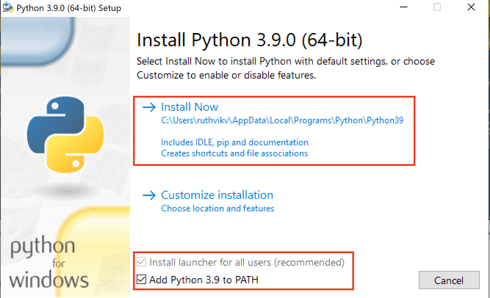
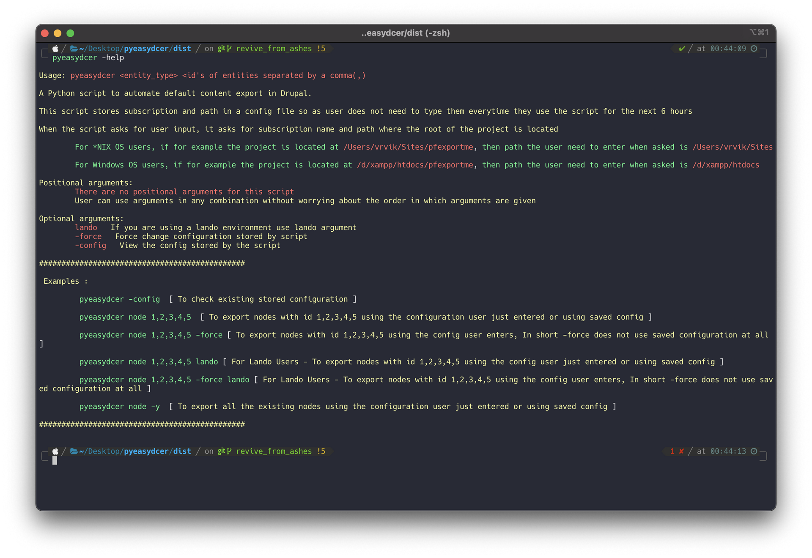
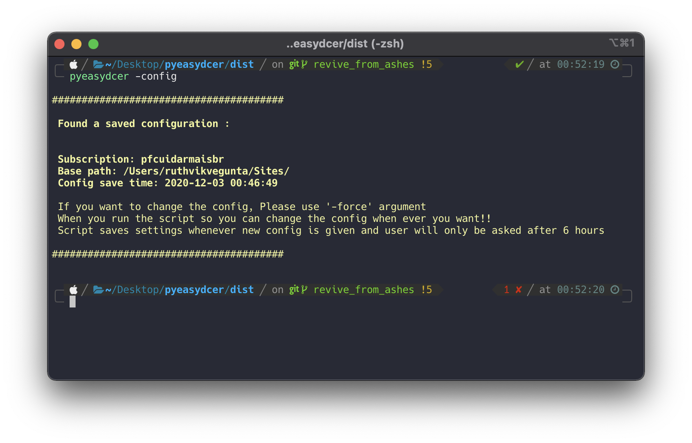
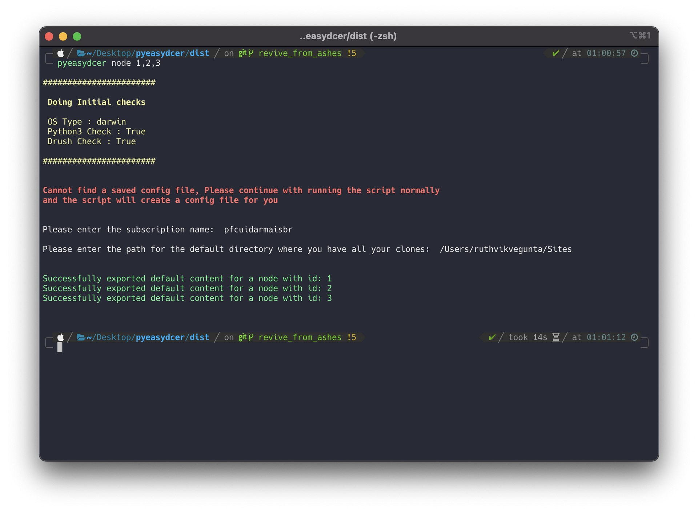
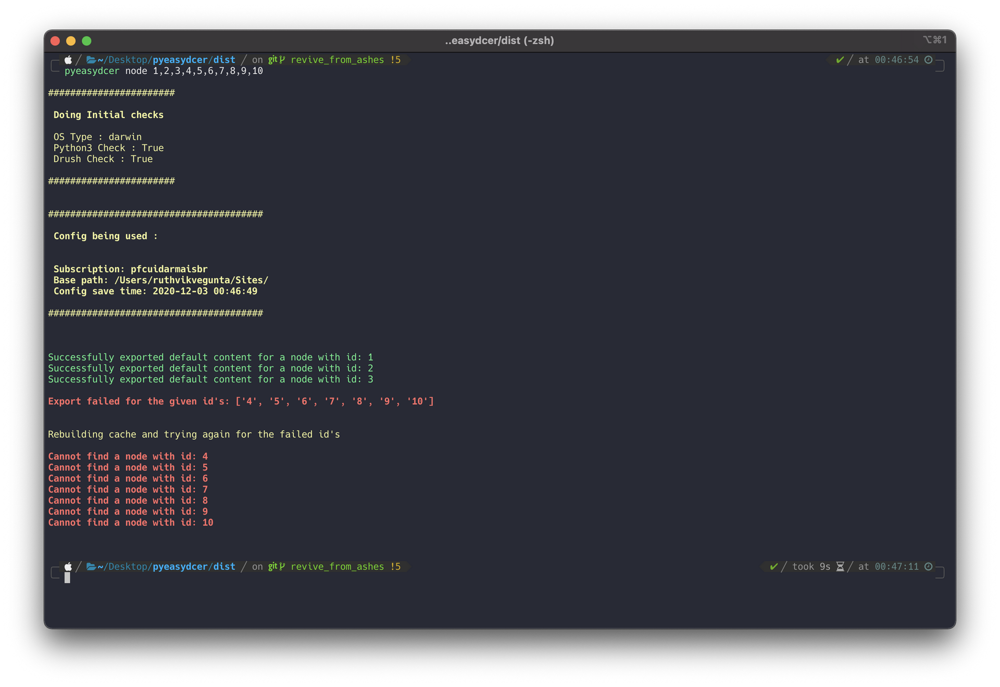
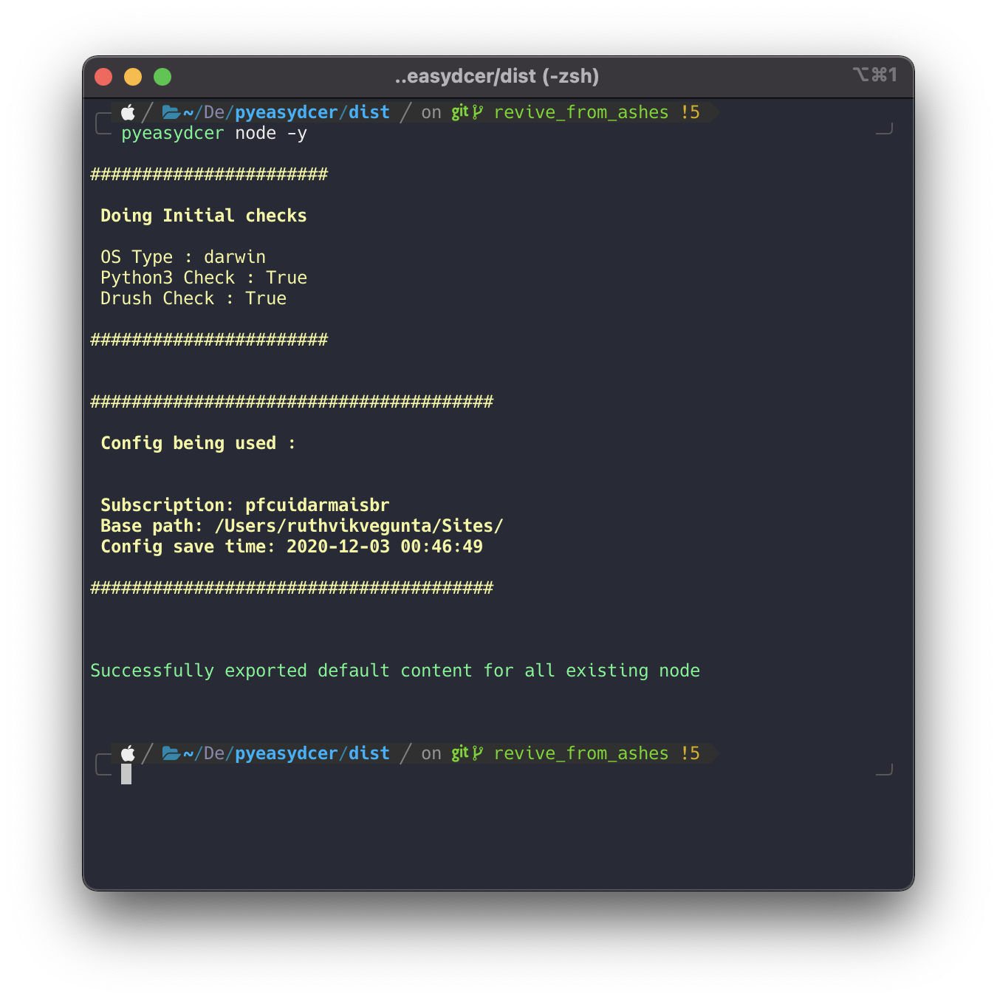
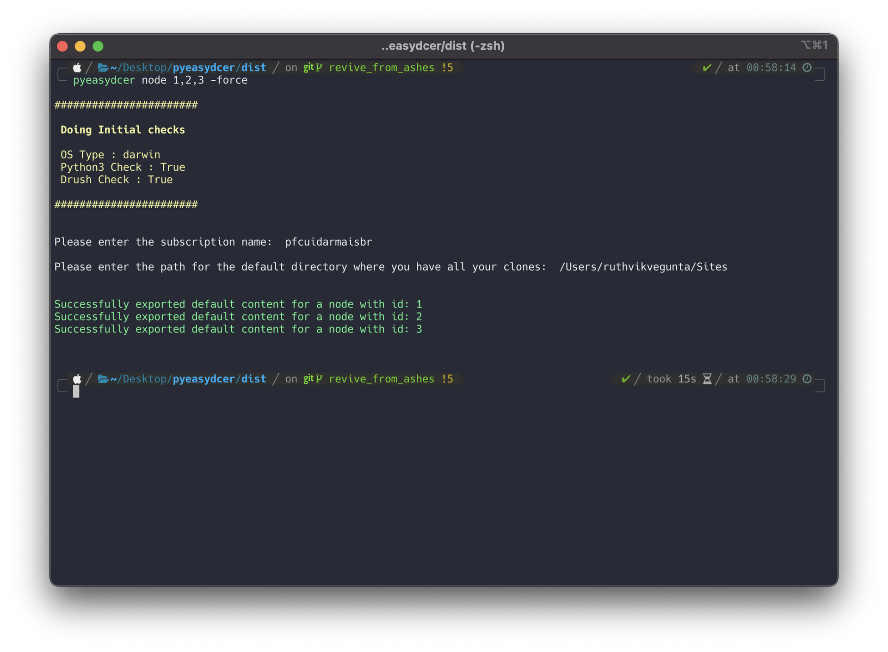

# pyeasydcer

[](https://pepy.tech/project/pyeasydcer)
[](https://pepy.tech/project/pyeasydcer)
[](https://pepy.tech/project/pyeasydcer)

pyeasydcer is a python script which aims at automating the default content export in drupal, thus saving users time and frustration

  - Supports all *NIX Operating Systems and Windows as well
  - Supports lando
---
##### Work to be done
+ Check if dcer module made any changes in the way default content is exported for D9
+ Multithreading support to make the execution time more faster
---
##### Perks
+ Allows user to export any number of entities in one go
+ User need not enter subscription name and path where local setup is located every time they use the script
+ User entered config is stored in a JSON file locally
    + For the next 6 hours script will not ask user to input subscription or path making user's work a bit more easy
+ pyeasydcer automatically adds a new line at the end for all the exported JSON's
+ pyeasydcer also places the exported content in the respective path, it does everything for the user. User just needs to push the changes after running the script
---
#### Requirements
+ Python v3.7+
+ pip3
+ drush
---
#### Brief Usage:
  + `pyeasydcer <entity_type> <id's of entities separated by a comma(,)>`
  + `pyeasydcer <entity_type> <id's of entities separated by a comma(,)> lando` (if using lando enviroment)
  + Refer to `pyeasydcer -help` for detailed help
---
## Installation
- This script requires python3.7 to run, if python is already installed on your system, you can check it's version with one of the following commands
- > python --version
- > python3 --version

- If the output you get when you run above commands is greater than or equal to 3.7.0, then you can proceed on to the main installation of the script
- If the output you get when you run above commands is not greater than or equal to 3.7.0, then you need to update the python version, just take google's help, there are 100's of blogs which explain how to do this.
	- Newer MAC Operating Systems are shipped with python3.7.0+ , so MAC users should not face any problem
	- Please refer to this blog, to upgrade python version on linux
		- https://tech.serhatteker.com/post/2019-09/upgrade-python37-on-ubuntu18/
- If you get python not found as an output, that means python is not Installed, so please install python first, again just take google's help, there are 100's of blogs which explain how to do this.
	- Windows Users, can download python installer from here
		-  https://www.python.org/ftp/python/3.9.0/python-3.9.0-amd64.exe
	-  When installing Python
	
	- Uncheck `Install launcher for all users` because that would need administrator users password
	- Make sure to select `Add Python to PATH` checkbox, so that the installer adds both python and pip to your $PATH variable

### Update to Newer Version
- Users who are already using this, you need to update the pyeasydcer to the latest version, For that please run the below command
> `pip install --upgrade pyeasydcer` or
> `pip3 install --upgrade pyeasydcer`

### Main Installation
+ You can directly install this script from pip as given below

  + `pip install pyeasydcer` or
  + `pip3 install pyeasydcer`

+ If you are cloning the repository, then you need to run the below commands to install the script on your system.

  + `python setup.py install` or
  + `python3 setup.py install`
---
# Detailed Usage

#### Use case 1
> Help Section is available for Users when they pass `-help` argument to the script



#### Use case 2
> User can use the `-config` argument anytime to check the config which is stored locally



#### Use case 3
> If the user is running pyeasydcer for the first time or of the saved config is 6 hours old, then pyeasydcer asks user for configuration
+ > pyeasydcer node 1,2,3



- Subscription name is the github subscription of the project
- Path is where the root of this project is located
- For Example:
	- Subscription is **pfexport**
	- It is located at **/Users/Sites/pfexportca**
	- **So in this case, subscription is *pfexport* and path is */Users/Sites***
- pyeasydcer now stores this config in a JSON file which is located at (`~/.pydcer_config/pydcer_settings.json`)


#### Use case 4
> User needs to supply id's of the entity they want to export in a comma(,) separated way
+ > pyeasydcer node 1,2,3,4,5,6,7,8,9,10



- What is happening in the above case is, pyeasydcer found a saved config file, so it is reusing the same subscription for this export and user wants to export nodes from id 1-10
	- pyeasydcer tries to export and when default content is not exported for an id, pyeasydcer clears the drupal cache for that site and tries again, if it fails again that means that an entity with that particualr ID does not exist
	- In the above image default content for node 1,2,3 are successfully exported, but for node 4-10 export has failed, so pyeasydcer tries to clear the drupal cache for this subscription and then tries to export the default content for failed ID's
- **This is what is depicted in the above image**

#### Use case 5
> If user wants to export all the existing id's of an entity, they can do so by giving the `-y` argument
+ > pyeasydcer node -y



#### Use case 6
> If user is working on multiple projects and in this process, let us say the saved config is pointing to Project A and now user wants to export Default content from Project B, then they can use `-force` argument
+ > pyeasydcer node 1,2,3 -force



- What is happening in the above case is, pyeasydcer is forced to ask the user for config
	- When ever `-force` argument is used, pyeasydcer does not look into the saved config at all
- **This is what is depicted in the above image**
---
### Supported Entities
- pyeasydcer supports these entities by default
	```
	block_content
	node
	menu_link_content
	file
	config_pages
	taxonomy_term
	paragraphs
	user
	```
- If user needs some other entity which is not mentioned in the above list, they can manually add that entity in this file (`~/.pydcer_config/available_entities.txt`)
---
### Note

- While giving path in a windows system, please use the path which gitbash shows, gitbash is like a mini linux virtual env for Windows, gitbash can run all UNIX commands and it uses UNIX conventions

- For Example, xampp folder inside D drive is shown as

> `D:\xampp` in Windows CMD Prompt, where as the same is shown as
> `/d/xampp` in gitbash

- So please use what gitbash shows you, if you are still confused, run `pwd` command in gitbash and it will print the present directory path you are in
---
### Known Issues

- pyeasydcer in general is built to give runtime output to the user, but in Windows Gitbash, Users may not see runtime output
	- This does not mean that pyeasydcer will not work on windows
	- It works perfectly on Windows
		- But the only caveat is, it won't show runtime output as progress for user, pyeasydcer only outputs once the whole exporting stuff is done
	- So please give pyeasydcer a minute to complete, `Don't think that somethink has gone wrong`
---
###### Enjoy Scripting 🙂
